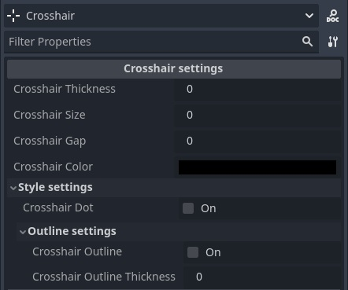

# Customizable Crosshair Lite

This addon provides a script only version of my [Customizable Crosshair](https://github.com/MarkVelez/godot-customizable-crosshair) with only basic features.

## Features

**Crosshair settings**
- Thickness
- Size (length of the lines)
- Gap (distance between the middle of the screen and the starts of the lines)
- Color
- Dot in the middle of the screen
- Crosshair outline with thickness adjustment
- Ability to convert crosshair settings into a string and vice versa.

## Usage

To add the crosshair to your game, simply add the `Crosshair` node, which can be found under `Control`, to your player's HUD or where ever you want to add it.

After this is done the crosshair can be customized within the editor.

*Note that the crosshair will not be visible inside of the editor unless the `@tool` at the top of the script is uncommented. To update the looks of the crosshair inside of the editor, simply toggle the visibility of the crosshair node.*

Updating the crosshair's looks can be done with the help of `updateCrosshairConfig()`. Optionally a dictionary with all the crosshair settings values can be passed through with the help of `getCrosshairSettings()` or via a JSON string form of the dictionary using `parseConfigString()`. To format a config dictionary to a JSON string, `getConfigString()` can be used.

